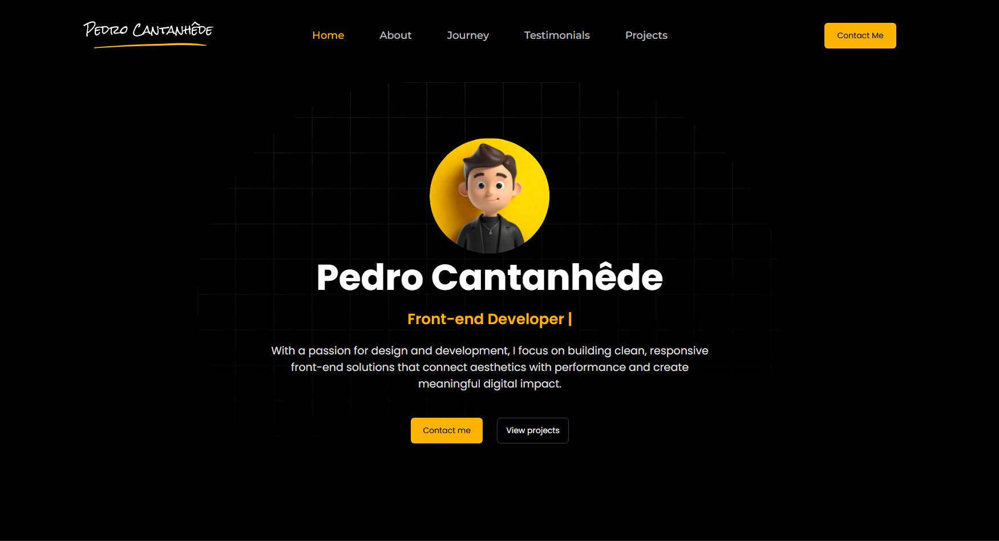
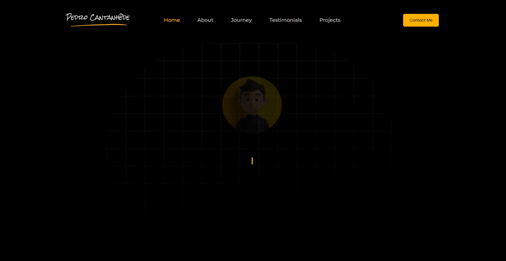
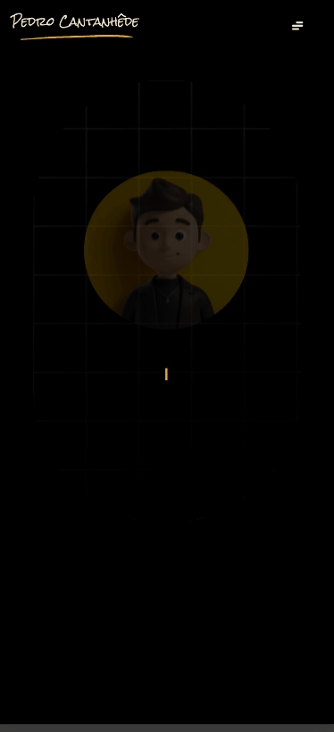
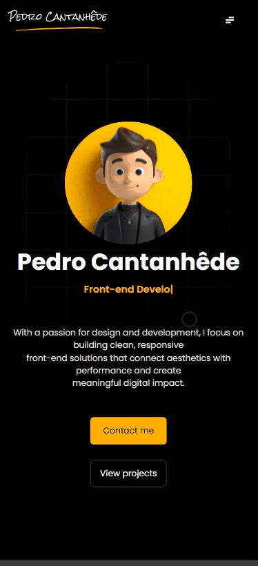

<h1 align="center">
    
</h1>

<div align="center">
    <h3> 🟡 Modern and responsive personal portfolio developed with React and TypeScript. 🟡 </h3>
    <a href="https://www.pedro-cantanhede.dev/" target="_blank">
      
    </a>
    <a href="https://github.com/PedroCantanhede" target="_blank">
      
    </a>
     
    
    
</div>

# Personal Portfolio

This is my modern and responsive portfolio built to showcase my work as a Front-End Developer. Here I present my skills, projects, professional experience, and contact information.

<p align="center">
  
</p>

# 🔨 Tecnologias

💻 React 18

💻 TypeScript

💻 Vite

💻 Tailwind CSS

💻 shadcn/ui

💻 Framer Motion

💻 Radix UI

💻 Lucide React

## :camera: Preview:

### Desktop Application



### Mobile Application





## :rocket: Installation

```bash

# Clone the repository

$ git clone https://github.com/PedroCantanhede/portfolio-cantanhede.git

# Enter the project folder

$ cd portfolio-cantanhede

# Install dependencies

$ npm install

# Run the application

$ npm run dev

# Open the project on port: 5173 - access: http://localhost:5173

```

## 🎨 Portfolio Sections

1. **Home (Hero)** - Main presentation with name, description and social links
2. **About** - Personal information, skills and resume download
3. **Journey** - Professional experience and education
4. **Testimonials** - Client and colleague testimonials
5. **Projects** - Projects developed with technologies used
6. **Contact** - Contact form and contact information
7. **Footer** - Quick links and social networks

## 🚀 Deploy

The project is hosted on Vercel and can be accessed at:

**[www.pedro-cantanhede.dev](https://www.pedro-cantanhede.dev/)**

### Available Scripts

- `npm run dev` - Runs the project in development mode
- `npm run build` - Generates the production build
- `npm run preview` - Preview the production build locally
- `npm run lint` - Runs the linter

## 📱 Responsiveness

The portfolio is fully responsive and works on:

- Desktop (1200px+)
- Tablet (768px - 1199px)
- Mobile (up to 767px)

## 📄 License

This project is under the MIT license. See the LICENSE file for more details.

## 🤝 Contributing

Contributions are welcome! Feel free to:

- Report bugs
- Suggest improvements
- Submit pull requests

## 📞 Contact

For questions or suggestions, contact me through the portfolio form or social networks.

---

<div align="center">
  <p>Developed with ❤️ by <a href="https://github.com/PedroCantanhede" target="_blank">Pedro Cantanhêde</a></p>
</div>
